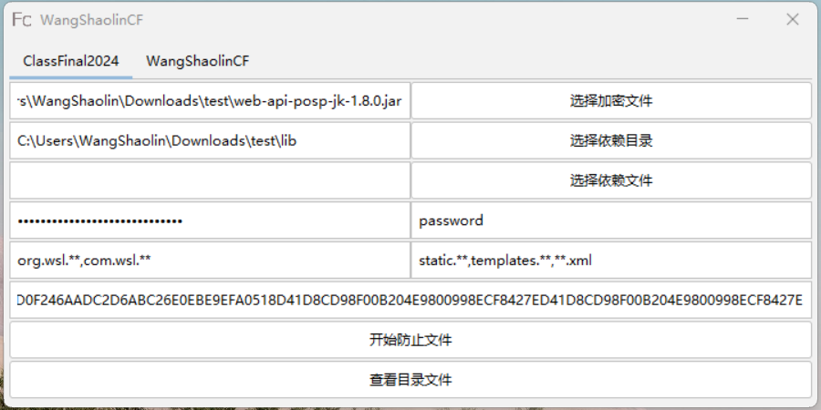
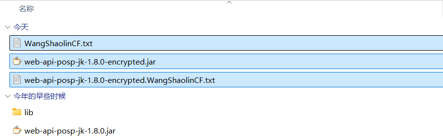
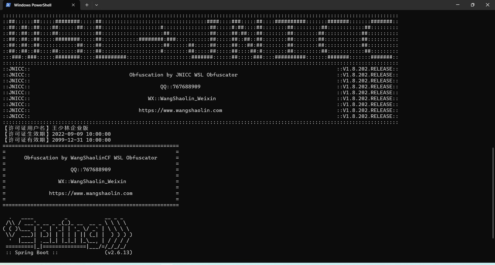
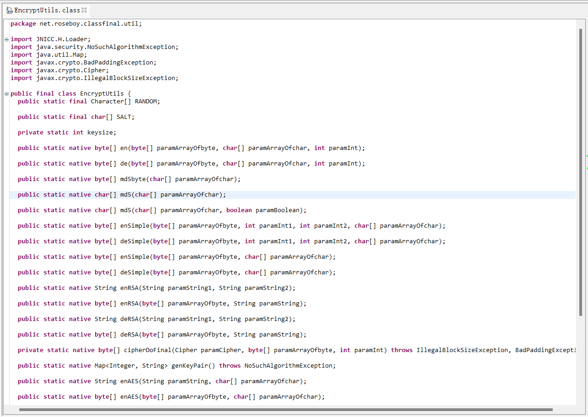
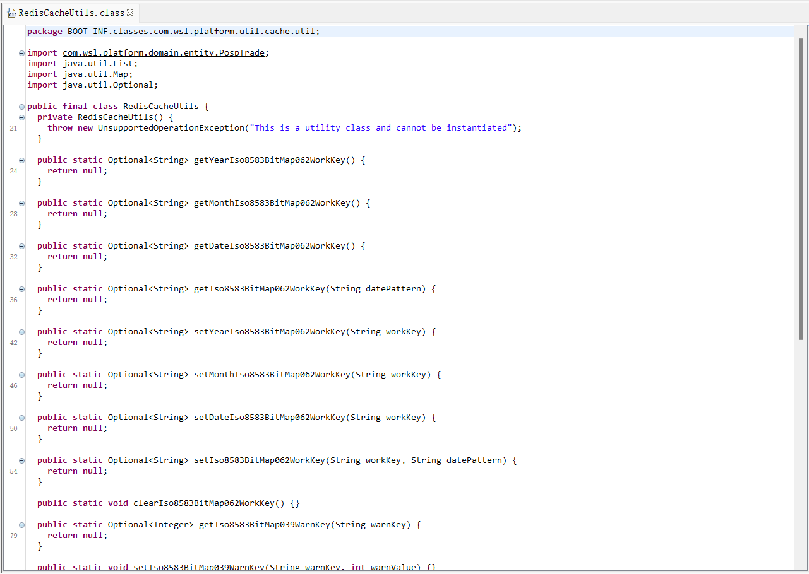
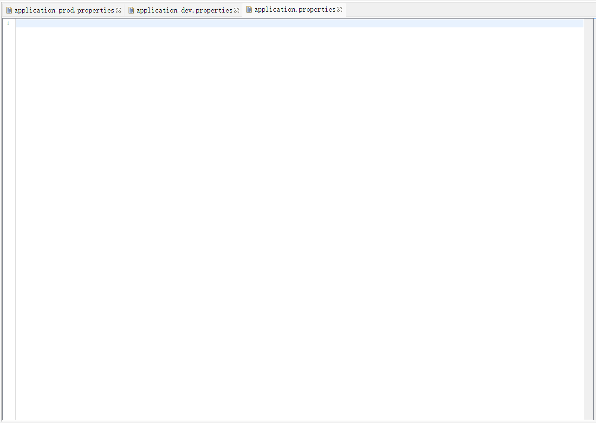
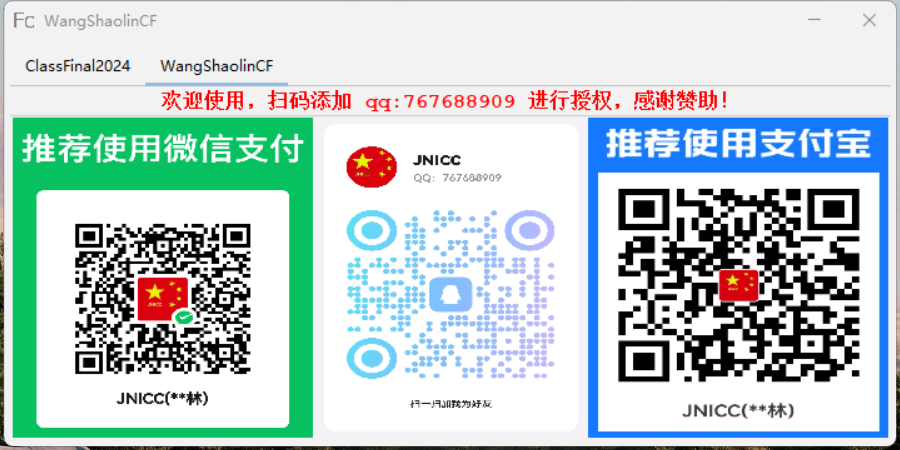

**WangShaolinCD**

***

**CodeFort**

**  
**

**特点：**

1.加解密代码采用JNI方式，隐藏所有实现细节，防止被内存解密，从而保证更安全；

2.业务代码采用字节码加密，支持class文件、jar库文件，并支持远程控制台提示和下线功能；

3.双密码、机器码、文件码，多维度字节码加密，防止加密后的文件被篡改运行破解；

4.可混淆普通jar包、可混淆依赖jar包、可混淆spring boot jar包等多种文件类型；

5.内置禁止虚拟机热点调试，防止被Dump运行代码,Try jstack -F or jmap -F；

6.可按需配置运行参数-XX:+DisableAttachMechanism等参数，防止Attach内存代码；

**界面：**

**演示：**

****

**运行：**

**清除：**

**平台：**

**业务：**

**配置：**

**加群：**

QQ：767688909  
QQ Group 01：693795906
